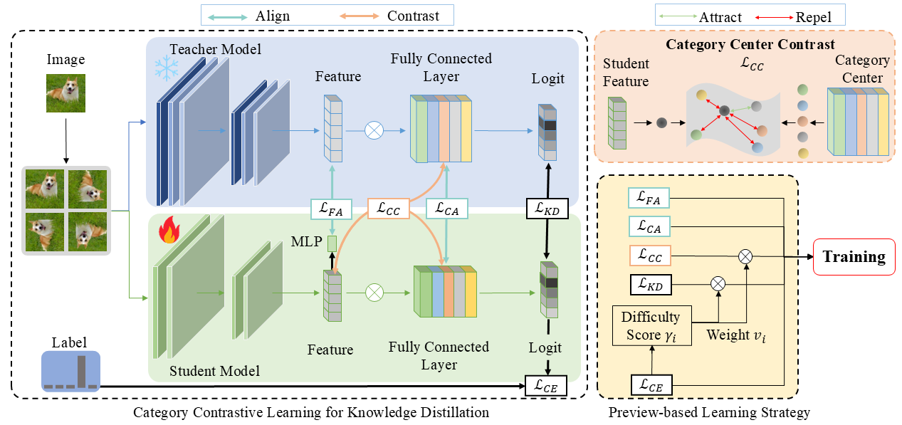

<div align="center">

<h2 align="center">
<b>Preview-based Category Contrastive Learning for Knowledge Distillation</b>
</h2>

<div>
Muhe Ding, Jianlong Wu, Xue Dong, Xiaojie Li, Pengda Qin, Tian Gan, Liqiang Nie
</div>

<br>

<div align="center">
    <a href="https://arxiv.org/abs/2410.14143" target="_blank">
    </a>
    <!-- 如果有项目页 / 代码 / huggingface 可以加 -->
</div>

</div>

---

## 🔥 Overview

We propose a novel knowledge distillation framework that improves student learning by modeling **category-level structure** rather than only instance-level alignment.  

Our method introduces:

- **Category Contrastive Learning** to capture inter-class relationships  
- **Preview Strategy** to adaptively adjust learning based on sample difficulty  

This enables more **discriminative representations** and better generalization performance. :contentReference[oaicite:0]{index=0}

---

## 🚀 Method



Given an input image, the teacher provides a **preview signal** (soft category information), which guides the student to learn better representations.

The framework consists of three key steps:

- **Feature Alignment**: align student features with teacher representations  
- **Category Contrast**: enforce intra-class compactness and inter-class separability  
- **Preview-guided Learning**: dynamically weight samples based on difficulty  

---

## 🧩 Key Components

### 🔹 Category Contrastive Learning
- Align instance features with category centers  
- Improve representation geometry  
- Enhance class separability  

---

### 🔹 Preview-based Learning Strategy
- Estimate sample difficulty from student predictions  
- Assign adaptive learning weights  
- Reduce the negative impact of hard samples  

---

### 🔹 Unified Objective
The final training objective combines:

- Knowledge distillation loss  
- Contrastive loss  
- Preview-guided weighting  

---

## 📊 Results


- Achieves superior performance over state-of-the-art KD methods  
- Evaluated on:
  - CIFAR-100  
  - ImageNet :contentReference[oaicite:1]{index=1}  

---

## 🧪 Usage

### Installation

```bash
git clone <your_repo>
cd <your_repo>
pip install -r requirements.txt
