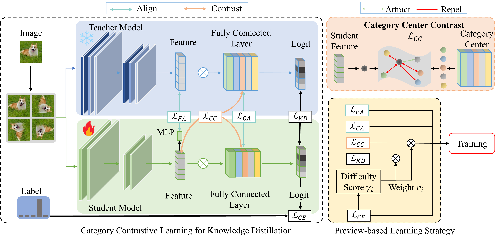
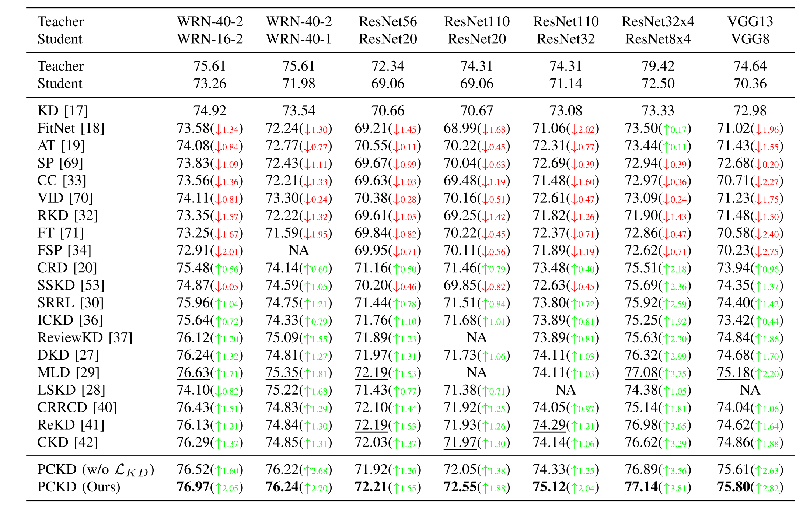

# PCKD

This repository contains the implementation of:

**Preview-based Category Contrastive Learning for Knowledge Distillation**

Muhe Ding, Jianlong Wu, Xue Dong, Xiaojie Li, Pengda Qin, Tian Gan, and Liqiang Nie.

Accepted by **IEEE Transactions on Circuits and Systems for Video Technology (TCSVT), 2025**.

- Paper: https://arxiv.org/abs/2410.14143
- IEEE: https://ieeexplore.ieee.org/document/10880570

## Overview

Knowledge distillation transfers knowledge from a large teacher network to a compact student network. Existing methods usually align instance-level logits or features, but they often ignore two useful signals:

- category-level information from the classifier weights, which can be viewed as category centers;
- sample difficulty, because hard samples should not be treated exactly like easy samples at the beginning of training.

PCKD addresses these issues with two components:

- **Category Contrastive Learning for Knowledge Distillation (CKD)**: distills feature representations, category centers, and their correlations. In code, the core category contrastive loss is implemented as `CategoryConLoss` in `helper/losses.py`.
- **Preview-based Learning Strategy**: dynamically weights each sample according to its difficulty. Hard samples receive smaller weights early in training and gradually contribute more as training proceeds. The weighting logic is implemented in the `pckd` branch of `helper/loops.py`.



The paper evaluates PCKD on CIFAR-100, ImageNet, STL-10, and TinyImageNet. This code release focuses on the CIFAR-100 training pipeline and related KD baselines inherited from the RepDistiller/CRD codebase.

## Installation

The original codebase was developed with PyTorch and CUDA. A typical setup is:

```bash
conda create -n pckd python=3.8 -y
conda activate pckd
pip install -r requirements.txt
```

Install a PyTorch build compatible with your CUDA version if it is not already included in your environment.

## Data and Teacher Checkpoints

Before training a student, prepare:

1. CIFAR-100 in Python format. The expected raw folder name is `cifar-100-python`.
2. A pretrained teacher checkpoint. The student script expects `--path_t` to point to a checkpoint whose dictionary contains the key `model`.

The current dataloader uses the dataset root configured in `dataset/cifar100.py`. Adjust `get_data_folder()` there to your local dataset path before running if needed.

Teacher checkpoints are commonly placed under:

```text
save/models/<teacher_run_name>/<teacher_model>_best.pth
```

For example:

```text
save/models/resnet110_cifar100_lr_0.05_decay_0.0005_trial_0/resnet110_best.pth
```

## Running PCKD on CIFAR-100

Run commands from the repository root.

### WRN-40-2 teacher to WRN-16-2 student

```bash
python train_student.py \
  --path_t teacher_pth \
  --distill pckd \
  -r 1 -a 1 -b 0.05 -f 20 \
  --model_s wrn_16_2 \
  --dataset cifar100
```

## Results Reported in the Paper

PCKD improves over KD and strong distillation baselines on CIFAR-100 for both same-family and heterogeneous teacher/student pairs. The paper also reports:




## Citation

If you find this repository useful, please cite:

```bibtex
@article{ding2025pckd,
  title={Preview-based Category Contrastive Learning for Knowledge Distillation},
  author={Ding, Muhe and Wu, Jianlong and Dong, Xue and Li, Xiaojie and Qin, Pengda and Gan, Tian and Nie, Liqiang},
  journal={IEEE Transactions on Circuits and Systems for Video Technology},
  year={2025}
}
```

## Acknowledgement

This work is built on the following repositories. Thanks to their great work.

- [RepDistiller](https://github.com/HobbitLong/RepDistiller/tree/master), for [Contrastive Representation Distillation](http://arxiv.org/abs/1910.10699) (ICLR 2020).
- [HSAKD](https://github.com/winycg/HSAKD), for [Hierarchical Self-supervised Augmented Knowledge Distillation](https://www.ijcai.org/proceedings/2021/0168.pdf) (IJCAI 2021)
- [ICKD](https://github.com/ADLab-AutoDrive/ICKD), for [Exploring Inter-Channel Correlation for Diversity-preserved Knowledge Distillation](https://arxiv.org/abs/2202.03680).
